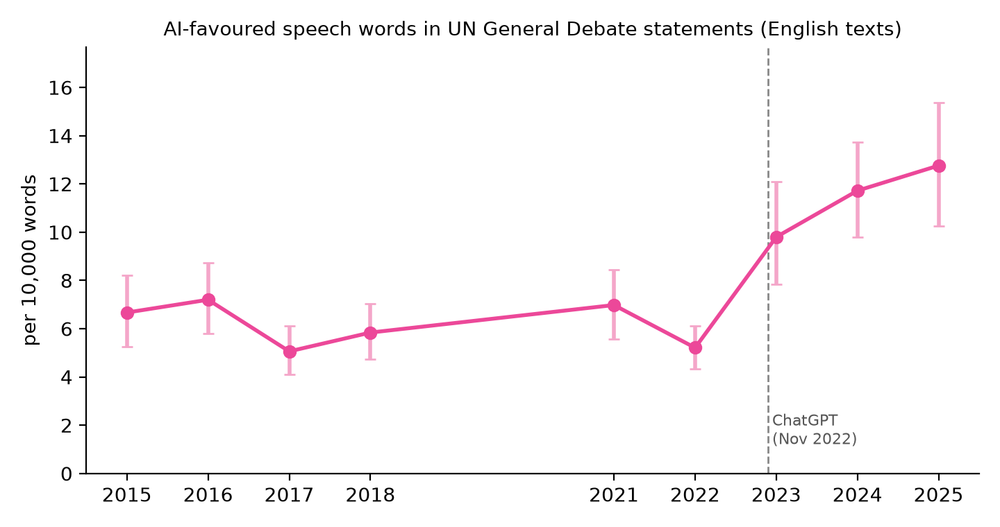
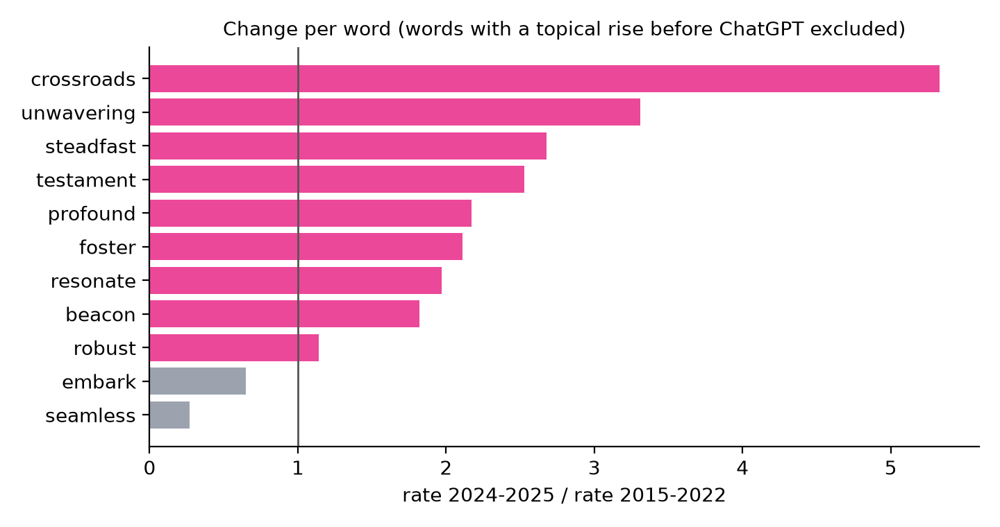
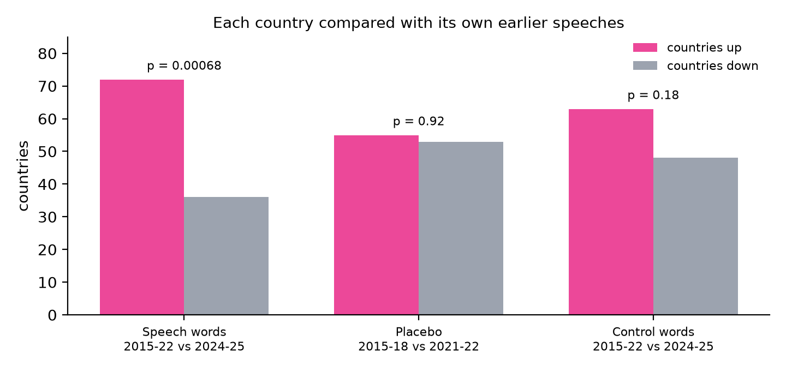

# Unwavering, Steadfast, Pivotal: AI-Favoured Speech Vocabulary Doubled in UN General Assembly Statements After ChatGPT (2015-2025)

**Fırat Mıhcı**¹

¹ Independent researcher (computational linguistics), HumanizeMy.ai Computational Linguistics Lab. Correspondence: hello@humanizemy.ai

*Preprint, September 2026. Prepared for public dissemination via ResearchGate.*

---

## Abstract

Large language models favour a recognisable register of ceremonial vocabulary: *unwavering commitment*, *a testament to*, *a pivotal moment*, *at a crossroads*. We ask whether that register has entered the most scrutinised political speeches in the world: the statements heads of state and government deliver at the United Nations General Assembly's annual General Debate. Using **956 English-language statements (1.85 million words)** published by delegations on the UN's official General Debate website across nine sessions (2015-2018 and 2021-2025), we track a pre-specified set of speech-register words that language models over-use. After removing five words whose rate had already risen before ChatGPT for topical reasons, the remaining eleven words occur **6.08 times per 10,000 words in 2015-2022 and 12.19 times in 2024-2025, a twofold increase**. The series stays flat across the six pre-ChatGPT sessions from 2015 to 2022 (5.1 to 7.2 per 10,000) and then climbs in every session after ChatGPT's release: 9.8 in 2023, 11.7 in 2024, 12.8 in 2025, and the 95% bootstrap intervals for 2024 and 2025 lie entirely above those of every pre-ChatGPT session. The share of statements using *unwavering* rose from about one in ten to **31% in 2024**. Comparing each country only with its own earlier statements, the rate rose in **72 countries and fell in 36** (three unchanged; sign test p = 0.0007). Three controls hold: a placebo comparison between two pre-ChatGPT periods shows no change (55 up, 53 down, p = 0.92); ordinary diplomatic vocabulary (*peace, security, sovereignty, cooperation*) shows no significant change (p = 0.18); and the rise persists in countries where English is an official language (35 up, 18 down, p = 0.027), so it is not only an artefact of machine translation. We also document a data trap: a widely used research corpus translated its 2024 statements with GPT-4o, which would have manufactured part of the effect. The finding does not attribute any statement to AI; it shows that the ceremonial register language models prefer is now measurably more common at the world's highest podium.

**Keywords:** large language models · political speech · United Nations General Assembly · lexical change · ChatGPT · computational linguistics · AI-assisted writing · reproducibility

---

## 1. Introduction

Every September, world leaders take the podium of the UN General Assembly Hall in New York for the General Debate. The statements are drafted for months, translated, archived and quoted. They are an unusually clean record of prepared political language: the same institution, the same occasion and roughly the same length every year.

Since ChatGPT's release in November 2022, readers have learned to notice a particular register in machine-written prose. Much of the public discussion concerns academic words such as *delve* and *intricate*. Speeches have their own version of that register: ceremonial intensifiers and stock metaphors such as *unwavering*, *steadfast*, *a testament to*, *a beacon of*, *at a crossroads*, *profound*. These phrases existed long before language models, which is exactly why they make a useful test. If their frequency in General Debate statements was stable for years and then moved after 2022, the change is visible against a long human baseline.

This paper asks one question: **did the ceremonial vocabulary that language models favour become more frequent in UN General Assembly statements after ChatGPT?** We answer it with a design built to fail if the answer is no: each country is compared with itself, a placebo comparison between two pre-ChatGPT periods must show nothing, ordinary diplomatic vocabulary must stay flat, and words that rose before ChatGPT for topical reasons are excluded by a rule fixed before the analysis ran.

The answer is yes. The effect is large (a doubling), consistent across countries, absent in the placebo and control comparisons, and present in states where English is an official language. We are careful about what it does not show. A word count cannot tell whether a speechwriter used an assistant, whether a delegation translated a text with one, or whether human writers have simply absorbed the register from the text around them. Our earlier work shows that the last mechanism is real in scientific writing. The measurement here is of the register itself, not of any individual author.

## 2. Related work

**AI vocabulary in the written record.** Liang et al. (2024) estimated the share of LLM-modified text in scientific papers and peer reviews from shifts in word frequencies. Kobak et al. (2025) identified "excess vocabulary" such as *delves*, *underscores* and *showcasing* across more than fifteen million biomedical abstracts. Liang et al. (2025) extended the approach beyond science to consumer complaints, corporate press releases, job postings and **UN press releases**, estimating that about 14% of UN press releases involved LLM-assisted writing by late 2024. Our study differs in genre: General Debate statements are speeches by heads of state and government, not institutional press output.

**Parliaments.** Researchers at Edinburgh Napier University reported that 15% of UK written ministerial statements in 2026 contained AI-assisted content, up from 3.5% in 2022 (Schofield, 2026). A study of the US Congressional Record found a measurable rise in generative-AI language markers, concentrated in the House of Representatives, peaking in 2024 (Mofaddel, 2026). No study we found examines the UN General Debate, the one podium that gathers nearly every government every year.

**Our earlier work.** *It Isn't Delve* (Mıhcı, 2026a) derived the words machine text over-uses relative to human text from a public benchmark. *The Fingerprint Is Leaking Into the Record* (Mıhcı, 2026b) showed that academic AI-register words rose about sevenfold in computational linguistics abstracts after ChatGPT while mathematics abstracts stayed flat. The present study moves from scientific prose to political oratory and finds that the effect is **register-specific**: the academic word list barely moves in speeches, while the ceremonial speech list doubles.

## 3. Data

### 3.1 Source

All statements come from the UN's official General Debate website (gadebate.un.org), which publishes, for each session and each speaking state, the statement PDFs supplied by the delegation. We collected country pages for sessions 70-73 (2015-2018) and 76-80 (2021-2025). Session 74 (2019) is not listed in the site's archive, and Session 75 (2020), held largely by pre-recorded video, is not listed by country in that archive, so both years are absent.

### 3.2 English-only statements

Delegation PDFs carry a language tag in their file name (for example `_en`, `_fr`, `_es`). We kept a statement only when the country page linked an English PDF and **no PDF in any other language**, which selects statements whose only published text is English. This keeps one text per speech and avoids pairing an original with its translation. After cleaning, statements shorter than 300 words were dropped.

| Session | Year | Statements | Words |
|---|---|---|---|
| 70 | 2015 | 101 | 191,972 |
| 71 | 2016 | 100 | 197,133 |
| 72 | 2017 | 123 | 245,120 |
| 73 | 2018 | 114 | 220,768 |
| 76 | 2021 | 94 | 186,165 |
| 77 | 2022 | 110 | 224,477 |
| 78 | 2023 | 111 | 218,389 |
| 79 | 2024 | 106 | 198,757 |
| 80 | 2025 | 97 | 164,578 |
| **Total** | | **956** | **1,847,359** |

The 2022 statements were delivered in September 2022, two months before ChatGPT's public release on 30 November 2022, so 2022 belongs to the pre-ChatGPT baseline.

### 3.3 Cleaning

PDF text was extracted with `pdftotext`. We removed page furniture ("check against delivery", page numbers), re-joined words hyphenated across line breaks and lines broken inside sentences, and collapsed runs of spaces. No words were altered.

### 3.4 A data trap we avoided

The most widely used research collection of these speeches, the UN General Debate Corpus (Jankin, Baturo and Dasandi, 2025), is an excellent resource for 1946-2023. Its documentation states, however, that for Session 79 (2024) statements in languages other than English **were translated into English with OpenAI's GPT-4o model**, and that Session 80 (2025) was **transcribed from interpretation audio with a speech recognition model**. Any analysis of AI vocabulary that ran across those years would partly measure the corpus's own processing. We therefore used the corpus only to check the data and built the analysis on the delegations' own published texts, which were produced the same way in every year.

## 4. Methods

### 4.1 Word lists

**Speech-register list (primary).** Before the first count, we wrote down sixteen words and word families that language models over-use in speech-like and ceremonial prose: *testament, unwavering, steadfast, resonate, navigate, foster, harness, beacon, embark, landscape, transformative, crossroads, profound, robust, seamless, bolster*. Each is matched with a word-boundary regular expression covering its inflections.

**Topical exclusion rule.** Some of these words can rise for reasons unrelated to AI, for example when a session's official theme uses them. Before running the tests, we fixed a rule: **a word is excluded if its 2022 rate, measured before ChatGPT existed, was already at least 1.5 times its 2015-2021 rate.** The rule excluded five words: *bolster, harness, landscape, navigate* and *transformative*. The last is the clearest case: the theme of the 2022 General Debate was "A watershed moment: transformative solutions to interlocking challenges", and the word's rate tripled that year. The remaining **eleven words** form the primary measure.

**Academic list (comparison).** The thirteen pure-stylistic academic words from our earlier study (*delve, intricate, underscore, showcase, nuanced, multifaceted, tapestry, realm, meticulous, delineate, paramount, myriad, pivotal*) are reported unchanged, to test whether academic and oratorical AI registers behave alike.

**Control list.** Eight staples of diplomatic speech with no association to language-model style: *sovereignty, cooperation, development, security, peace, dialogue, support, people*.

### 4.2 Measures

For each session we compute the rate of list words per 10,000 words (total matches divided by total words) and a 95% confidence interval from 2,000 bootstrap resamples of statements. We also report the share of statements containing at least one occurrence of a given word.

### 4.3 Paired country test

Session composition changes from year to year, so pooled rates could move simply because different countries published English texts. The main test therefore compares each country with itself. For every country with at least 500 words in both periods, we compute its pooled rate in the **baseline period (2015-2018, 2021-2022)** and in the **post period (2024-2025)**, and count how many countries rose and how many fell. A two-sided sign test asks whether rises outnumber falls more than chance allows. 2023, ten months after ChatGPT's release, is shown in the yearly series but left out of the paired test as a transition year.

### 4.4 Falsification checks

1. **Placebo.** The same paired test between two periods that both precede ChatGPT (2015-2018 against 2021-2022) must show no rise.
2. **Control vocabulary.** The control list must not rise the way the speech list does.
3. **English-official states.** Delegations may supply English translations of speeches delivered in other languages, and translations could themselves be produced with AI tools. Restricting the paired test to the 57 member states where English is an official language removes most translated texts.
4. **Sensitivity.** The paired test is repeated with all sixteen speech words, topical ones included.

## 5. Results

### 5.1 Flat from 2015 to 2022, then a climb in every session

The eleven-word speech register moved within a narrow band from 2015 to 2022 and then rose in each session after ChatGPT (Figure 1).

| Year | Rate per 10,000 words | 95% CI | Statements using *unwavering* |
|---|---|---|---|
| 2015 | 6.67 | 5.24-8.21 | 11.9% |
| 2016 | 7.20 | 5.81-8.72 | 13.0% |
| 2017 | 5.06 | 4.09-6.11 | 8.9% |
| 2018 | 5.84 | 4.74-7.04 | 11.4% |
| 2021 | 6.98 | 5.56-8.43 | 10.6% |
| 2022 | 5.21 | 4.32-6.12 | 10.0% |
| 2023 | 9.80 | 7.84-12.09 | 18.0% |
| 2024 | 11.72 | 9.79-13.72 | **31.1%** |
| 2025 | 12.76 | 10.25-15.37 | 27.8% |

Pooled, the rate is **6.08 per 10,000 words in 2015-2022 and 12.19 in 2024-2025**. The lower bounds of the 2024 interval (9.79) and the 2025 interval (10.25) both sit above the upper bound of every pre-ChatGPT year (highest: 8.72 in 2016); the 2023 interval still overlaps the baseline. Nearly one statement in three used *unwavering* in 2024, against about one in ten in every year from 2015 to 2022.

### 5.2 Which words moved

| Word | 2015-2022 (per 100k) | 2022 alone | 2024-2025 (per 100k) | Change |
|---|---|---|---|---|
| crossroads | 1.3 | 1.8 | 7.2 | 5.3× |
| unwavering | 6.4 | 5.8 | 21.2 | 3.3× |
| steadfast | 5.8 | 3.6 | 15.7 | 2.7× |
| testament | 1.7 | 2.2 | 4.4 | 2.5× |
| profound | 9.0 | 8.9 | 19.5 | 2.2× |
| foster | 13.0 | 12.0 | 27.5 | 2.1× |
| resonate | 2.4 | 1.8 | 4.7 | 2.0× |
| beacon | 3.5 | 1.8 | 6.3 | 1.8× |
| robust | 8.9 | 8.0 | 10.2 | 1.1× |
| embark | 7.7 | 5.3 | 5.0 | 0.7× |
| seamless | 1.0 | 0.9 | 0.3 | 0.3× |

Eight of the eleven words rose, most of them by a factor of two or more, and none of the eight had already risen in 2022. *Robust* stayed flat, while *embark* and *seamless* fell (Figure 2). The rise is therefore concentrated in ceremonial intensifiers and stock metaphors (*unwavering, steadfast, a testament to, at a crossroads*) rather than spread evenly across every word a model might use.

### 5.3 Country by country

| Comparison | Countries | Rose | Fell | Tied | Sign test p |
|---|---|---|---|---|---|
| Speech words, 2015-2022 vs 2024-2025 | 111 | **72** | **36** | 3 | **0.0007** |
| Placebo: speech words, 2015-2018 vs 2021-2022 | 116 | 55 | 53 | 8 | 0.92 |
| Control words, 2015-2022 vs 2024-2025 | 111 | 63 | 48 | 0 | 0.18 |
| Speech words, English-official states only | 53 | 35 | 18 | 0 | 0.027 |
| All 16 speech words (no exclusion) | 111 | 71 | 39 | 1 | 0.003 |
| Academic list (13 words), 2015-2022 vs 2024-2025 | 111 | 48 | 47 | 16 | 1.00 |

Twice as many countries rose as fell (Figure 3). The placebo shows the kind of noise the test produces when nothing happened: an even split. The control vocabulary rose modestly in pooled terms (183 to 196 per 10,000 words, about 7%) without a significant majority of countries, while the speech list doubled. The effect holds among English-official states and without the topical exclusion.

### 5.4 The academic list does not transfer

The thirteen academic words that rose sevenfold in computational linguistics abstracts (Mıhcı, 2026b) show no consistent movement in General Debate statements: 48 countries rose, 47 fell, p = 1.00, although the pooled rate moved from 2.05 to 3.41 per 10,000 words on the strength of a few frequent users. *Pivotal* is the exception inside that list, rising from 2.3 to 7.2 per 100,000 words. AI-associated vocabulary is not one list. Each genre carries its own register, and a word that signals machine style in an abstract says little about a speech.

## 6. Discussion

### 6.1 What the doubling means

The result establishes a change in register, not authorship. At least three mechanisms can produce it. Speechwriters may draft or polish with language models, which supply the ceremonial phrasing they favour. Delegations may translate statements with AI tools, although the effect in English-official states argues against translation as the only cause. And writers may absorb the register from the growing volume of machine-shaped text they read every day, the diffusion mechanism we documented in scientific abstracts. These mechanisms can operate together, and a word count cannot separate them for any single statement. It can show, with a long baseline and a clean placebo, that the register at the General Assembly podium changed when language models arrived.

### 6.2 The 2026 General Debate as a test

The general debate of the 81st session opens on 22 September 2026. The yearly series makes a simple prediction: if the trend continues, the speech-register rate in 2026 English statements will stay at or above the 2024-2025 level of about 12 per 10,000 words, and *unwavering* will again appear in more than one statement in four. Because the delegation texts are published on the same website in the same form, the prediction can be checked within days of the session closing, and we will update this analysis with the 2026 statements.

### 6.3 Implications for reading and detecting AI text

Word lists are a weak tool for deciding who wrote a text. If the ceremonial register doubles in human-delivered speeches, a reader or a tool that treats *unwavering* or *a testament to* as evidence of machine authorship will increasingly misjudge genuine human writing. The genre result sharpens the point: the words that mark machine style in one register are neutral in another. Judgements about authorship need signals that are calibrated to the genre in question and that do not move simply because human writing has absorbed the vocabulary.

## 7. Limitations

**Coverage.** The analysis uses English-only delegation texts, about half of all statements each year, and two sessions (2019, 2020) are unavailable in comparable form. The paired design protects against changes in which countries appear, but results for statements published only in other languages are not measured here.

**Prepared versus delivered text.** Delegation PDFs are prepared statements and can differ from the words spoken in the Hall. For a study of drafting language, the prepared text is the relevant record.

**Word lists.** The speech list reflects our judgement of the register language models favour in ceremonial prose. We fixed it before counting, published the exclusion rule with its outcome, and report every word, including the three that did not rise. Other reasonable lists would give different magnitudes.

**No attribution.** Nothing in this study identifies whether any particular statement was written with AI assistance, and no country or speaker should be characterised on that basis.

## 8. Conclusion

In English-language statements to the UN General Assembly, the ceremonial vocabulary that language models favour held steady from 2015 to 2022 and then doubled, rising in 72 countries and falling in 36 when each was measured against its own earlier speeches. A pre-ChatGPT placebo and ordinary diplomatic vocabulary show no comparable change, and the rise persists where English is an official language. The same study shows that AI-associated vocabulary is genre-specific and that a popular research corpus contains AI-processed text in exactly the years such studies examine. The register of the world's highest podium has changed; the tools we use to read it need to change with it.

## Data and code availability

The list of source PDFs (with their UN URLs), per-statement word and match counts, all scripts, tables and figures are openly available at https://github.com/humanizemyai/unga-ai-speech-nlp. The source statements are public on gadebate.un.org, so every number in this paper can be reproduced from the UN's own website.

## References

Jankin, S., Baturo, A., and Dasandi, N. (2025). Words to unite nations: The complete United Nations General Debate Corpus, 1946-present. *Journal of Peace Research*, 62(4), 1339-1351.

Baturo, A., Dasandi, N., and Mikhaylov, S. (2017). Understanding state preferences with text as data: Introducing the UN General Debate Corpus. *Research & Politics*, 4(2).

Kobak, D., González-Márquez, R., Horvát, E.-Á., and Lause, J. (2025). Delving into LLM-assisted writing in biomedical publications through excess vocabulary. *Science Advances*.

Liang, W., Zhang, Y., Wu, Z., et al. (2024). Mapping the increasing use of LLMs in scientific papers. arXiv:2404.01268.

Liang, W., Zhang, Y., Codreanu, M., et al. (2025). The widespread adoption of large language model-assisted writing across society. *Patterns*. arXiv:2502.09747.

Mıhcı, F. (2026a). It Isn't Delve: The real lexical signature of machine-generated text. Preprint, ResearchGate. https://www.researchgate.net/publication/407437375

Mıhcı, F. (2026b). The fingerprint is leaking into the record: AI-register vocabulary in human scientific abstracts after ChatGPT. Preprint, ResearchGate. https://doi.org/10.13140/RG.2.2.14890.38085

Mofaddel, I. (2026). Generative artificial intelligence text in congressional speeches. *The iJournal: Student Journal of the Faculty of Information*, 11(2).

Schofield, K. (2026, 10 September). Exclusive: Soaring numbers of MPs' statements are being written using artificial intelligence. *HuffPost UK*.

United Nations (2015-2025). General Debate statements, Sessions 70-80. https://gadebate.un.org
